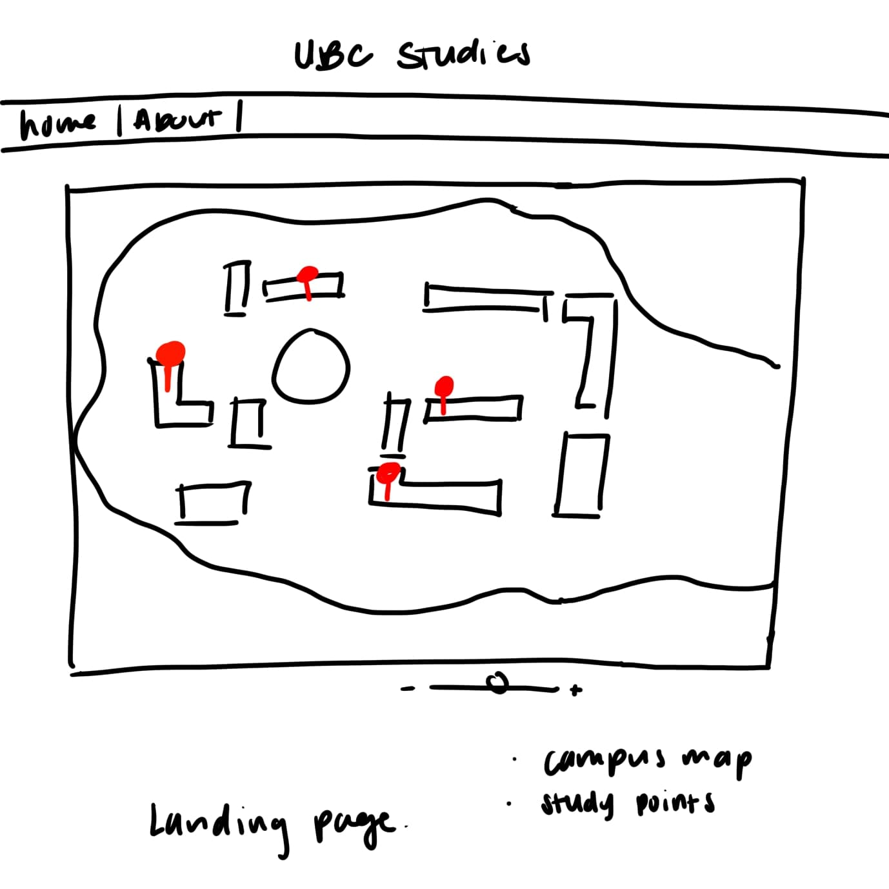
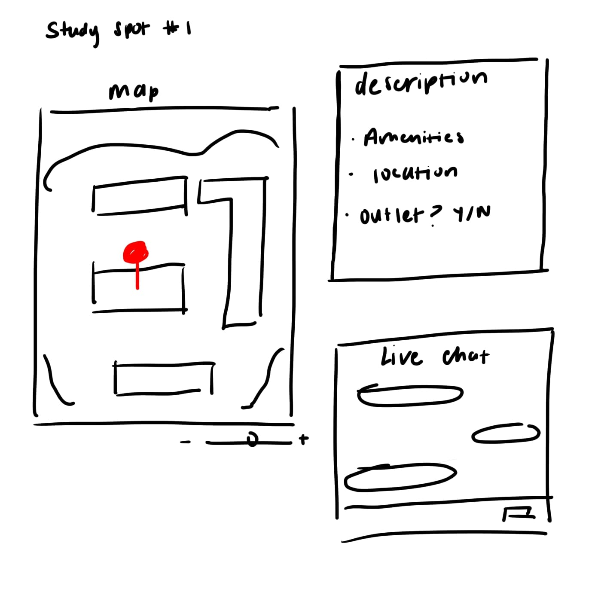
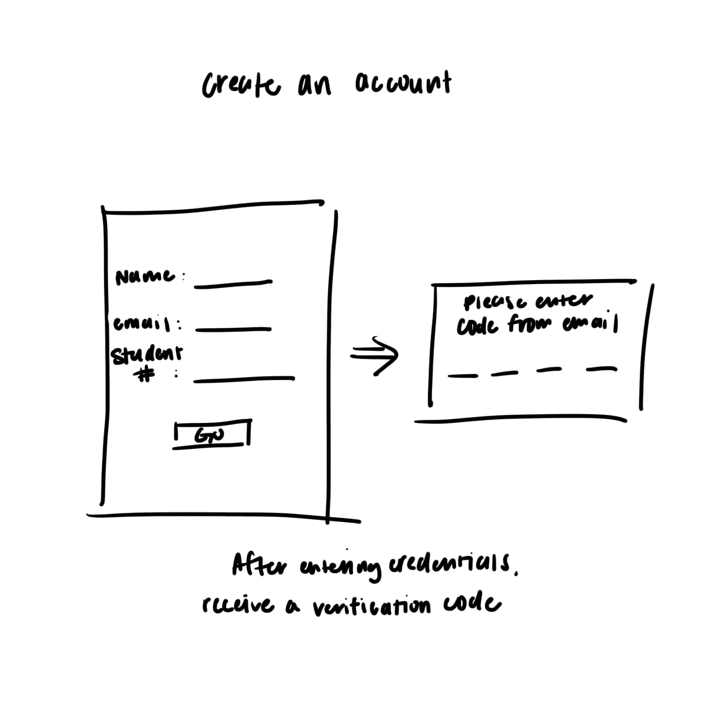

# Group 18 - StudySpotter: UBC’s hottest study spot finder

Welcome to StudySpotter, the ultimate solution for UBC students on the hunt for the perfect study spot! Say goodbye to the frustration of wandering around campus looking for a place to study. Our app provides real-time updates on the best study locations, complete with availability, amenities, and even local chatboxes to connect with fellow students. With StudySpotter, you can effortlessly find and reserve your ideal study space, ensuring you always have the perfect environment to hit the books and ace your exams. Get ready to revolutionize your study sessions with StudySpotter!

## About our topic/interest

As a UBC student, finding a place to study can be a challenging task. Despite the abundance of libraries, study lounges, and quiet spaces, prime locations often fill up quickly, especially during midterm and final season. Whether you're trying to find a spot for yourself or a group of friends, it can be a draining task to find the perfect place where everyone's needs are satisfied. From jam packed areas to a lack of available outlets, students are having to navigate around different areas of the campus to secure the right spot, which can be a time-consuming process. As such, we wish to lighten this burden by providing a tool that will help mitigate the need for students to stress over finding the perfect spot that will suit their needs.

## Team Members

- Dylan Zhang: Black Ops III enthusiast.
- Gurmandeep Bal: Minecraft Architect
- Crystal Yim: Squishmallow connoisseur 
- Allison Kong: Just your average gamer :)
- Linus Chen: Has an unused Playstation

## Project Description:
The UBC Study Spot Tracker App, designed for students at the University of British Columbia, facilitates the location and reservation of study spots on campus. It will store and display information about study spots, including availability, location, and amenities, allowing users to view maps, reserve spaces, and communicate via local chatboxes for each study location. Users can manage their reservations and navigate to different spots directly within the app. Depending on time availability, the app will focus on core functionalities like mapping and booking, with optional features like user authentication for chatboxes and distance measurements between spots considered as enhancements if time permits.

## Project task requirements:

- Minimal requirements:
  * A map of campus which highlights all known study spots.
  * The ability to select each study spot and be provided with basic information such as lighting, power port availibilty, etc
  * A robust interface for desktop users
- Standard requirements:
  * A local chatbox for each study spot where users can talk to eachother.
  * Robustness for mobile browsers
  * Ability to select distance from one study spot to another point on the map.
  * Addition of study spots booking links from various websites, such as the UBC library website.
- Stretch requirements:
  * Account creations and authenication via student email to keep chatbox free of bots
  * Implement frequency of study spots display on maps
  * Chat auto moderation

## Two Minimal Requirements broken down:
* A map of campus which highlights all known study spots.
  1. Set Up the Frontend Environment (using React.js and Node.js).
  2. Create the necessary backend endpoints to handle study spot data.
  3. Embed the Google Maps component in the React front end and ensure it displays the map centered on UBC.
  4. Create React components to display the map and interact with the study spot data.
  5. Ensure the frontend communicates with the backend to fetch and display study spots dynamically.

* The ability to select each study spot and be provided with basic information such as lighting, power port availibilty, etc
  1. Determine and Compile information on various study spots such as lighting, availability of power ports, noise level, and seating for each location.
  2. Set up MongoDB to store study spot data and create an Express.js API to handle CRUD operations for study spots.
  3. Implement functionality to fetch study spot information from the backend based on user selection and display this information on the frontend.
  4. Enable users to click or tap on study spots on the map, triggering a request for spot information, which is then displayed in a user-friendly format on the interface.
 

## Images
### Landing Page

### Study Spot Details

### Create an Account 

## References

{Add your stuff here}
